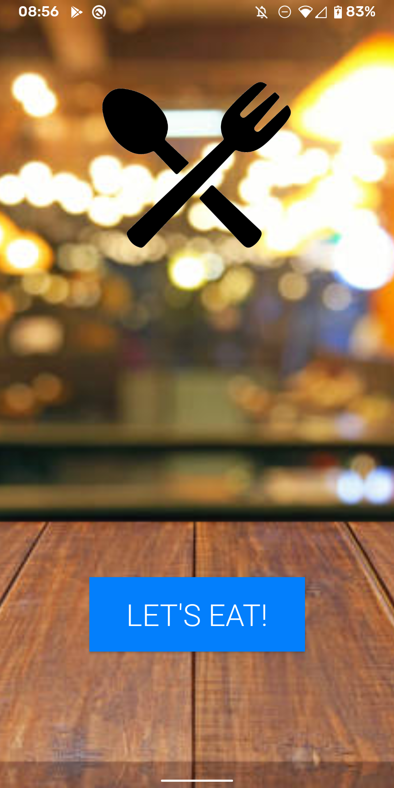

# lets-eat

## Introduction
Let's Eat is my first stab at Android development. This app relies on https://www.themealdb.com/ which is an API that currently has over 230 meals! I thought this project would be good practice on GUI development in Android, JSON parsing, and API calls. 

## Features
* User can click a button that will get a random meal from an external API
* The app displays recipe name, ingredients, instructions and a picture of the meal
* By clicking the button again, another meal is generated

## Compilation
This project has been designed in Android Studio. Compilation can be acheived through cloning and importing the project into Android Studio and running it. An APK can be found in releases so the current version can be installed on any Android phone.

## Author
* Solomon Heisey

